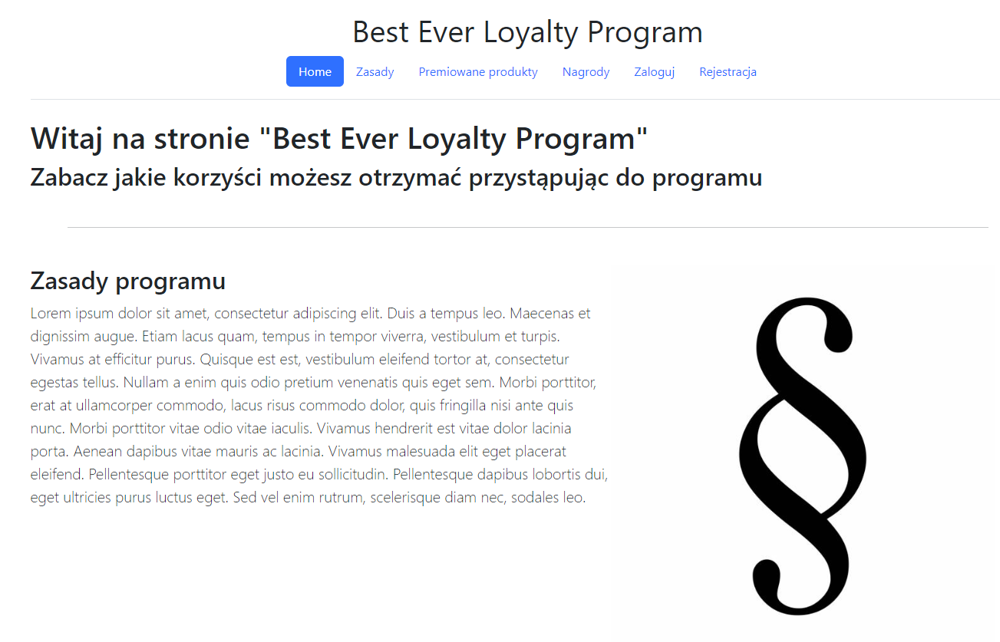
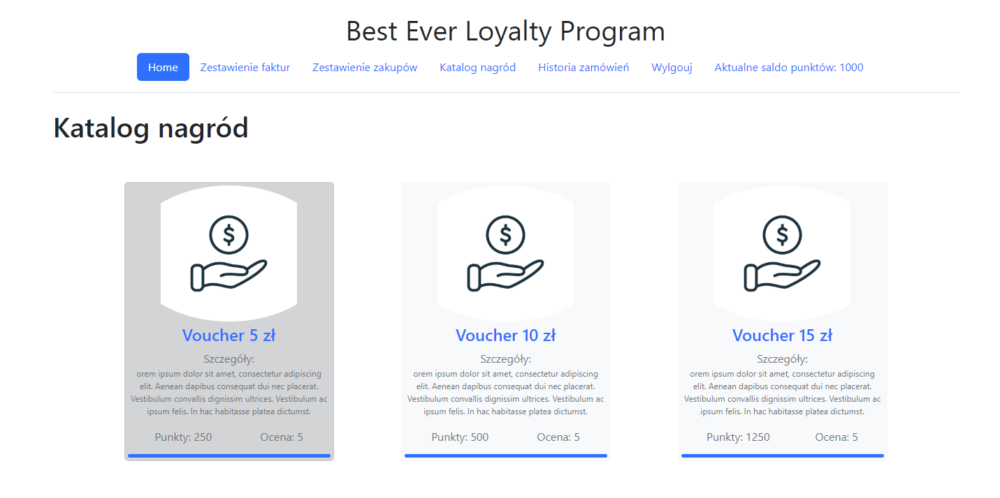
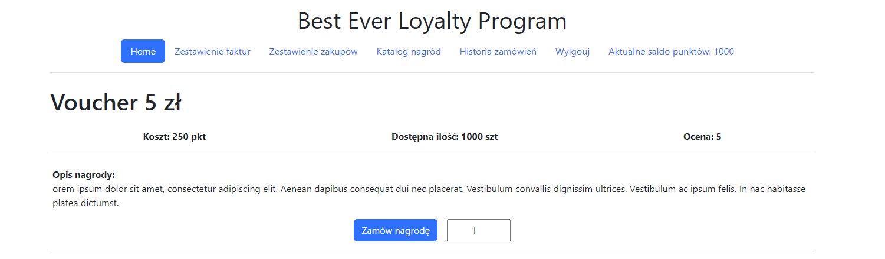

# Loyalty program

## Application description

Loyalty program application.

### Requirements:


```asgiref==3.7.2
Django==5.0
psycopg2-binary==2.9.9
sqlparse==0.4.4
tzdata==2023.3
```

## Instalation & configuration:

### Step 1: Install PostgresSQL locally.
```
sudo apt-get install postgresql 
```

### Step 2: Clone repository.
```
path/to/folder
git clone git@github.com:LaskiKa/Loyalty-program.git
```
### Step 3: Create virtual enviroment & install requirements.txt
```
python -m venv venv
source venv/bin/activate
pip install -r requirements.txt
```

### Step 4: Setup database.
```
create database 'Database Name'

set postgresql database in settings.py or loccaly
DATABASES = {
    'default': {
        'HOST': '127.0.0.1',
        'NAME': 'loyalty-program-db',
        'ENGINE': 'django.db.backends.postgresql',
        'USER': '',  
        'PASSWORD': '',
    }
}
```
## management functions
[import data][https://github.com/LaskiKa/Loyalty-program/blob/b0a1ae1244f2e817ed5796363ad33bb04162fa97/Loyalty_project/Loyalty_program_app/management/commands/importdata.py]

## Screen shots
### Loyalty Program Rule


### Prize catalog


### Prizze details & order

